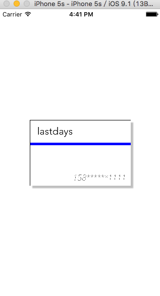

# iOS设计模式-适配器

## 简介

很好奇，什么是适配器，大家有没有听说过电源适配器，其实原理都是一样的，就是说我们的iPhone手机，在中国，可以用iPhone充电器给手机充电，都知道，中国的电压是220V，对吧，我们的iPhone额定输入电压是5V，其实这就是我们适配器的功劳，而且，我们的充电器在中国能用，当然如果我们去了美国，没过不是220V，难道我们的手机就不能充电了吗？当然肯定不会，总结来说：**在计算机编程中，适配器模式（有时候也称包装样式或者包装）将一个类的接口适配成用户所期待的。一个适配允许通常因为接口不兼容而不能在一起工作的类工作在一起，做法是将类自己的接口包裹在一个已存在的类中。**        

## 为何使用适配器？

### 直接赋值的缺点

最简单明了就是直接写一个示例来说名

制作一张卡片：


对卡片的数据直接赋值：

``` bash
#import "ViewController.h"
#import "BusinessCard.h"

@interface ViewController ()

@end

@implementation ViewController

- (void)viewDidLoad {
    [super viewDidLoad];
    // Do any additional setup after loading the view, typically from a nib.

    
    BusinessCard *card = [[BusinessCard alloc] initWithFrame:BUSINESS_FRAME];
    card.name = @"姓名";
    card.color = [UIColor blueColor];
    card.phoneNumber = @"电话";
    
    card.center = self.view.center;
   
    
    [self.view addSubview:card];
 
    
}

- (void)didReceiveMemoryWarning {
    [super didReceiveMemoryWarning];
}


@end
```

运行结果：


非常简单的一个示例，这基本上就是我们以前经常使用的一种方法直接赋值，这种的缺点，其实很简单，就是耦合性太强了，简简单单的移除更改，可能就会造成很多地方进行更改。现在看起来很简单就更改，但是如果我们的数据很多很多呢？

因此我们现在简单的来改进一下，设计一个model。并且在BusinessCard添加如下代码:

``` bahs
/**
 *  初始化数据
 *
 *  @param model BusinessCard
 */
-(void)loadDataWithModel:(Model *)model{
    self.name        = model.name;
    self.phoneNumber = model.phoneNumber;
    self.line        = model.lineColor;
}
```

ViewController:

``` bash
@interface ViewController ()

@end

@implementation ViewController

- (void)viewDidLoad {
    [super viewDidLoad];
    // Do any additional setup after loading the view, typically from a nib
    Model *model = [[Model alloc] initWithName:@"lastdays" phoneNumber:@"158******1111" lineColor:[UIColor blueColor]];
    BusinessCard *card = [[BusinessCard alloc] initWithFrame:BUSINESS_FRAME];
    card.center = self.view.center;
    [card loadDataWithModel:model];
    [self.view addSubview:card];
}

- (void)didReceiveMemoryWarning {
    [super didReceiveMemoryWarning];
}
@end
```

这样就降低了一些耦合性，这就是以对象形式赋值。

但是我们现在来阐述一个很致命的问题，那就是如果我们来了一个新的Model数据类型，其中的UIcolor是二进制形的。跟我们原来处理的数据类型不符合？这个时候怎么办？

其实解决方案很简单，这也就是上面提到过的，电源适配器原理。

## 使用适配器模型

电源有输入和输出，当然我们先来构建适配器

CardAdapterProtocol:

``` bash
#import <Foundation/Foundation.h>
#import <UIKit/UIKit.h>

@protocol CardAdapterProtocol <NSObject>


- (NSString *)name;

- (UIColor *)lineColor;

- (NSString *)phoneNumber;

@end

```

CardAdapter:

``` bash
#import <Foundation/Foundation.h>
#import "CardAdapterProtocol.h"
#import <UIKit/UIKit.h>


@interface CardAdapter : NSObject<CardAdapterProtocol>

/**
 *  建立输入关系
 */
@property(nonatomic,weak) id data;

/**
 *  与输入对象建立联系
 *
 *  @param data 输入的对象
 *
 *  @return 当前实例对象
 */
- (instancetype)initWithModel:(id)data;

@end
``` 

``` bash
#import "CardAdapter.h"

@implementation CardAdapter

- (NSString *)name{
    return nil;
}

- (UIColor *)lineColor{
    return nil;
}

- (NSString *)phoneNumber{
    return nil;
}

@end
```

这里我们构建了**CardAdapterProtocol**协议，以及抽象类**CardAdapter**，接下来就是创建**ModelCardAdapter**，这就是针对**Model**构建的适配器，然后覆盖内部方法进行重写。

这里需要做一下说明**CardAdapter**中通过**initWithModel**建立与Model的输入关系，就是我们在国内用充电器给手机充电，CardAdapter与Model的关系就是充电器跟220V电压的关系。


接下来就该建立充电器跟手机的关系了，这里面相当于构建CardAdapter和View的关系。

BusinessCard

``` bash
/**
 *  初始化卡片数据
 *
 *  @param model BusinessCard
 */
-(void)loadDataWithModel:(id<CardAdapterProtocol>)data{
    self.name        = [data name];
    self.phoneNumber = [data phoneNumber];
    self.line        = [data lineColor];
}
```

这样，我们基本上就完成了构建,测试：

ViewController：

``` bash
#import "ViewController.h"
#import "BusinessCard.h"
#import "Model.h"
#import "ModelCardAdapter.h"


@interface ViewController ()

@end

@implementation ViewController

- (void)viewDidLoad {
    [super viewDidLoad];
    // Do any additional setup after loading the view, typically from a nib.

    
    Model *model = [[Model alloc] initWithName:@"lastdays" phoneNumber:@"158******1111" lineColor:[UIColor blueColor]];
    
    //建立充电器跟电源关系
    CardAdapter *cardAdapter = [[ModelCardAdapter alloc] initWithModel:model];
    
    
    BusinessCard *card = [[BusinessCard alloc] initWithFrame:BUSINESS_FRAME];
    card.center = self.view.center;
    
    //建立手机跟充电器关系
    [card loadDataWithModel:cardAdapter];
    [self.view addSubview:card];
}

- (void)didReceiveMemoryWarning {
    [super didReceiveMemoryWarning];
}


@end
```

测试结果：



以上我们使用的就是类适配器，当然还有一种叫做对象适配器，就是说无论我们是220V，还是100V，用这一个充电器都能给手机充电。这种如何实现？简单的说就是我们可以构建一个**Adapter**继承**CardAdapter**,简单的举个例子

Adapter

``` bash
- (NSString *)name {
    
    NSString *name = nil;
    
    if ([self.data isMemberOfClass:[Model class]]) {
        
        Model *model = self.data;
        name         = model.name;
        
    } else if ([self.data isMemberOfClass:[NewCardModel class]]) {
        
        NewCardModel *model = self.data;
        name                = model.name;
        
    }
    
    return name;
}
```

根绝对象类型进行判断返回哪种处理结果。这种其实并不推荐，因为什么？因为现在的数据模型比较少，如果有10个，20个数据模型，那这个类到最好会非常的臃肿，并不方便我们维护。

## 总结

### 优点

优点显而易见，就是让适配器可以让我们的View更加强大，可以适配不同的数据，降低我们的耦合性

### 缺点

其实在代码中就可以看出来，一个简单赋值的东西，用了这么多东西，比较麻烦，有的时候是很繁琐的。但是呢？话又说回来，我们如果做了一个很牛的控件，为了提高它的通用性，加一个适配器会更好一些。 当我们的代码能力增加。但是呢？ 这同样也是一个缺点，那就是代码的可读性不好。这点的权衡就靠自己来衡量，虽然麻烦一些，但是确实能够提高扩展性。


