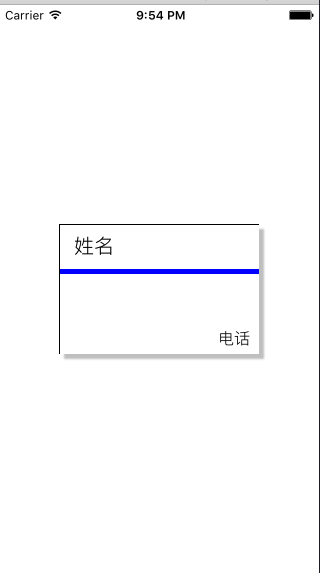
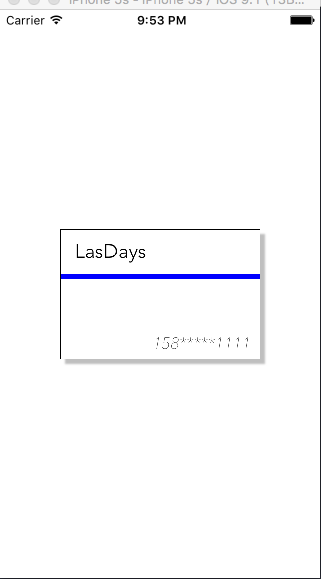

# iOS设计模式-适配器

## 简介

很好奇，什么是适配器，大家有没有听说过电源适配器，其实原理都是一样的，就是说我们的iPhone手机，在中国，可以用iPhone充电器给手机充电，都知道，中国的电压是220V，对吧，我们的iPhone额定输入电压是5V，其实这就是我们适配器的功劳，而且，我们的充电器在中国能用，当然如果我们去了美国，没过不是220V，难道我们的手机就不能充电了吗？当然肯定不会，总结来说：**在计算机编程中，适配器模式（有时候也称包装样式或者包装）将一个类的接口适配成用户所期待的。一个适配允许通常因为接口不兼容而不能在一起工作的类工作在一起，做法是将类自己的接口包裹在一个已存在的类中。**        

## 为何使用适配器？

### 直接赋值的缺点

最简单明了就是直接写一个示例来说名

制作一张卡片：




对卡片的数据直接赋值：

``` bash
#import "ViewController.h"
#import "BusinessCard.h"

@interface ViewController ()

@end

@implementation ViewController

- (void)viewDidLoad {
    [super viewDidLoad];
    // Do any additional setup after loading the view, typically from a nib.

    
    BusinessCard *card = [[BusinessCard alloc] initWithFrame:BUSINESS_FRAME];
    card.name = @"姓名";
    card.color = [UIColor blueColor];
    card.phoneNumber = @"电话";
    
    card.center = self.view.center;
   
    
    [self.view addSubview:card];
 
    
}

- (void)didReceiveMemoryWarning {
    [super didReceiveMemoryWarning];
}


@end
```

运行结果：




非常简单的一个示例，这基本上就是我们以前经常使用的一种方法直接赋值，这种的缺点，其实很简单，就是耦合性太强了，简简单单的移除更改，可能就会造成很多地方进行更改。现在看起来很简单就更改，但是如果我们的数据很多很多呢？

因此我们现在简单的来改进一下，设计一个model。并且在BusinessCard添加如下代码:

``` bahs
/**
 *  初始化数据
 *
 *  @param model BusinessCard
 */
-(void)loadDataWithModel:(Model *)model{
    self.name        = model.name;
    self.phoneNumber = model.phoneNumber;
    self.line        = model.lineColor;
}
```

ViewController:

``` bash
@interface ViewController ()

@end

@implementation ViewController

- (void)viewDidLoad {
    [super viewDidLoad];
    // Do any additional setup after loading the view, typically from a nib
    Model *model = [[Model alloc] initWithName:@"lastdays" phoneNumber:@"158******1111" lineColor:[UIColor blueColor]];
    BusinessCard *card = [[BusinessCard alloc] initWithFrame:BUSINESS_FRAME];
    card.center = self.view.center;
    [card loadDataWithModel:model];
    [self.view addSubview:card];
}

- (void)didReceiveMemoryWarning {
    [super didReceiveMemoryWarning];
}
@end
```


这样就降低了一些耦合性，这就是以对象形式赋值。


